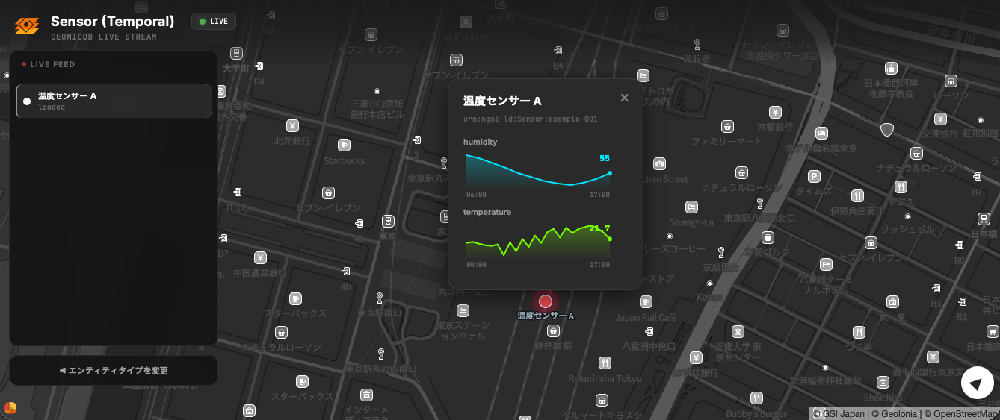

# GeonicDB Monitor — サンプルアプリケーション



GeonicDB SDK を使った Vite ベースの Web アプリケーションのサンプルです。
GeonicDB に保存されたエンティティを地図上にリアルタイム表示します。

## 利用している GeonicDB の機能

| 機能 | 説明 |
|------|------|
| **Bearer JWT 認証** | メール + パスワードでログインし、アクセストークンとリフレッシュトークンを取得 |
| **マルチテナント** | `NGSILD-Tenant` ヘッダーによるテナント切り替え |
| **NGSI-LD エンティティ取得** | `GET /ngsi-ld/v1/entities` でエンティティ一覧を取得 |
| **Temporal API** | `GET /ngsi-ld/v1/temporal/entities` で時系列データを取得し、スパークラインで可視化 |
| **WebSocket リアルタイム通知** | `subscribe()` + `connect()` でエンティティの作成・更新をリアルタイム受信 |
| **エンティティタイプ一覧** | `GET /ngsi-ld/v1/types` で登録済みタイプを取得 |

## ファイル構成

```
index.html          HTML マークアップ
src/
  main.js           エントリポイント（認証フロー・起動）
  auth.js           認証管理（ログイン、トークン保存、SDK ロード）
  app.js            アプリ本体（地図、データ取得、WebSocket、UI）
  style.css         スタイル
vite.config.js      Vite 設定
.env.example        環境変数のテンプレート
```

## セットアップ

### 1. 依存パッケージのインストール

```bash
npm install
```

### 2. 環境変数の設定

```bash
cp .env.example .env
```

`.env` を編集して GeonicDB サーバーの URL を設定します:

```
VITE_GEONICDB_URL=https://geonicdb.geolonia.com
VITE_GEOLONIA_API_KEY=YOUR-API-KEY    # Geolonia Maps の API キー（任意）
```

### 3. 開発サーバーの起動

```bash
npm run dev
```

ブラウザでログイン画面が表示されます。GeonicDB のメールアドレスとパスワードを入力してログインしてください。マルチテナント環境の場合はテナント名も入力します。

## サンプルデータの作成

[geonic CLI](https://www.npmjs.com/package/@geolonia/geonicdb-cli) を使って、`location`（GeoProperty）を持つエンティティを作成すると地図上に表示されます。

```bash
geonic entities create '{
  "id": "urn:ngsi-ld:Sensor:example-001",
  "type": "Sensor",
  "name": { "type": "Property", "value": "温度センサー A" },
  "temperature": { "type": "Property", "value": 22.5, "unitCode": "CEL" },
  "location": {
    "type": "GeoProperty",
    "value": { "type": "Point", "coordinates": [139.7671, 35.6812] }
  }
}'
```

## ビルド

```bash
npm run build     # dist/ にプロダクションビルドを出力
npm run preview   # ビルド結果のプレビュー
```

## デプロイ

### 環境変数

| 変数名 | 必須 | 説明 |
|--------|------|------|
| `VITE_GEONICDB_URL` | Yes | GeonicDB サーバーの URL |
| `VITE_GEOLONIA_API_KEY` | No | Geolonia Maps の API キー |

### Vercel

1. リポジトリを GitHub にプッシュし、Vercel にインポート
2. 環境変数を設定
3. デプロイ（Vite が自動検出されます）

## 使い方

1. ログイン画面でメールアドレス・パスワード（・テナント名）を入力
2. エンティティタイプを選択して「Open」
3. 地図上のマーカーをクリックするとプロパティ詳細をポップアップ表示
4. 左側の Live Feed をクリックするとエンティティにフォーカス
5. WebSocket 接続中はリアルタイムでエンティティの追加・更新が反映
6. 時系列データがある場合はスパークラインチャートで自動表示

## ライセンス

MIT
